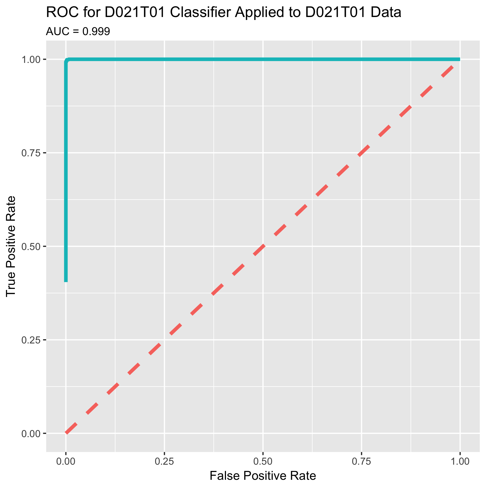
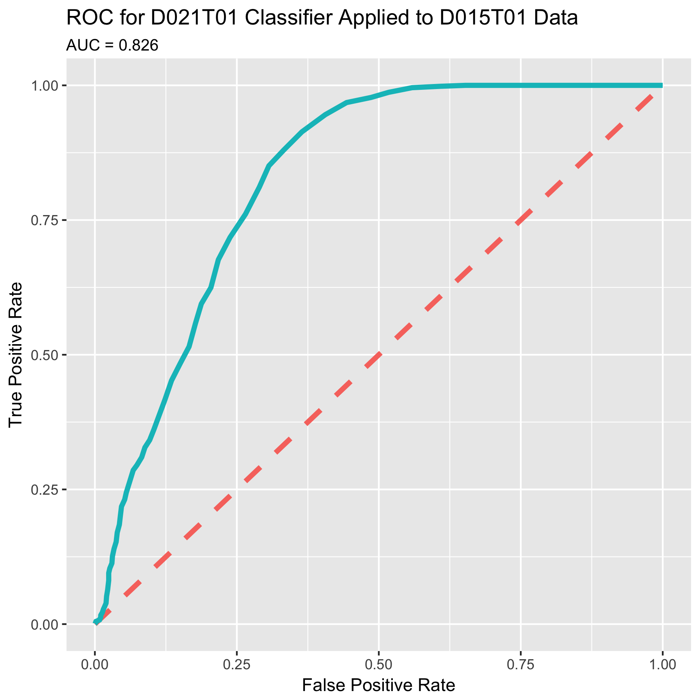

```{r setup}
library(PROMISE)
library(ggplot2)
library(reshape2)
library(cluster)

# Directories and files
# config_dir = "/collab-ag-fischer/PROMISE/data-10x-4t-c-16z/configdir"
config_dir = "/local-collab-ag-fischer/PROMISE/data-10x-4t-c-16z/configdir"
mutations_fn = "/local-collab-ag-fischer/PROMISE/mutations.csv"
data_dir = "/Users/jansauer/Thesis/Projects/PROMISE/FeatureAnalysis/python_package/dead_organoid_classifier"
source(file.path(config_dir, "watchdogConfig.R"))
```

# Introduction 

I trained a random forest classifier on live and dead objects using positive (Bortezomib and Irinotecan/SN-38 @ 0.2 and 1.0) and negative control wells (DMSO). I then applied this classifier to the entire screen to determine how many dead and live organoids are in each well. The organoid features were preprocessed by normalizing them to the DMSO values to remove any plate effects:

$$ feature = \frac{feature - median_{DMSO}}{MAD_{DMSO}}$$

The resulting features are therefor a measure of the deviation from the DMSO controls that can be compared across plates and cell lines due to the MAD scaling.

The classifier was trained for each cell line individually. The preprocessing and the training of the classifiers was done in a python script. Shown here are the results.

# Accuracy of Classifiers

This "transfer learning matrix" is an indication of the complexity of individual cell lines and their similarities.

[**Transfer Learning Matrix**. The classifiers were trained for each cell line individually and then applied to all other cell lines](images/diagnostic_matrix.png)

The ROC of the classifiers show that they exhibit a phenomenally high accuracy. Even when applied to other cell lines they can still deliver adequate results.

 | 
----------------------------------------- | ----------------------------------------
 | 

# Load Data

```{r load_data}
all_plates = sort(list.files(path = data_dir, pattern = "^D0"))
all_plates = sort(unique(substr(all_plates, 1, 14)))

# Use only plates that haven't been reimaged
use_plates = c()
for(plate in all_plates) {
  reimaged_flag = ifelse(test = substr(plate, 9, 9) == "9", yes = TRUE, no = FALSE)
  if(reimaged_flag) {
    use_plates = c(use_plates, TRUE)
    next
  }
  reimaged = plate
  substr(reimaged, 9, 9) = "9"
  use_plates = c(use_plates, ifelse(
    test = reimaged %in% all_plates, 
    yes = FALSE, no = TRUE))
}
all_plates = sort(all_plates[use_plates])

# Load data
mortality = list()
for(plate in all_plates) {
  # dat = read.csv(file.path(data_dir, plate, sprintf("%s_organoid_classification.csv", plate)))
  dat = read.csv(file.path(data_dir, sprintf("%s_organoid_classification.csv", plate)))
  rownames(dat) = paste0(plate, "_", substr(dat$Well.ID, 1, 1), "_", substr(dat$Well.ID, 2, 3))
  dat$X = NULL
  mortality[[plate]] = dat
}
mortality = do.call(rbind, mortality)
rownames(mortality) = sapply(strsplit(rownames(mortality), ".", fixed = TRUE), "[[", 2)
```

Keep only wells with replicates
```{r}
rep_id = paste0(substr(rownames(mortality), 1, 7), "_", substr(rownames(mortality), 12, 19))
wells_to_keep = names(which(table(rep_id) == 2))
mortality = mortality[rep_id %in% wells_to_keep, ]
```

# Classifier Verification

There are three steps to showing that the classifier does actually differentiate between live and dead cells. For this verification I do not differentiate between cell lines as the ratios of dead cells should, in princple, be directly comparable.

## Training Set Verification

First, I look at the training data, the positive and negative controls mentioned above, and confirm that these are all classified correctly. A look at the violin plot shows that both positive and negative controls are overwhelmingly correctly predicted. As expected, the negative control wells exhibit a larger range of dead organoid fractions. This is because organoids do die off naturally in some cases. In particular, this shows the robustness of the classifier with regards to partially incorrectly labelled training data.
```{r}
pos_ctrls = mortality[
  mortality$Product.Name %in% c("Bortezomib", "Irinotecan / SN-38") & 
  mortality$concentration %in% c(0.2, 1.0), ]

neg_ctrls = mortality[
  mortality$Product.Name %in% c("DMSO"), ]

ggplotdf = data.frame(
  "Percent.Dead" = c(pos_ctrls$Percent.Dead, neg_ctrls$Percent.Dead), 
  "Control" = rep(c("POS", "NEG"), c(nrow(pos_ctrls), nrow(neg_ctrls))))

ggplot(data = ggplotdf) + geom_violin(aes(x = Control, y = Percent.Dead, fill = Control)) + 
  theme(legend.position = "none") + ggtitle("Percent of Organoids Classified as Dead") + 
  xlab("") + ylab("Percent Dead")

```

```{r}
most_dead_dmso = strsplit(
  rownames(neg_ctrls[order(neg_ctrls$Percent.Dead, decreasing = TRUE)[2],]), 
  "_")[[1]]

most_dead_dmso_fn = thumbnailFilename(
  filedir = file.path(htmldir, most_dead_dmso[[1]]), 
  platename = most_dead_dmso[[1]], row = most_dead_dmso[[2]], 
  col = most_dead_dmso[[3]], configdir = config_dir, level = 1, 
  addPath = TRUE)
```

The "most dead" DMSO well is pictured here.


## Positive Control Gradients

The classifier was trained on concentrations of 0.2 and 1.0 of both Bortezomib and Irinotecan / SN-38. Both of these concentrations led to a complete death of all organoids in the wells. As a second verification step, I take a look at the lower concentrations of these two drugs.

```{r}
pos_ctrls = mortality[mortality$Product.Name %in% c("Bortezomib", "Irinotecan / SN-38"),]
pos_ctrls$concentration = as.factor(pos_ctrls$concentration)
ggplot(data = pos_ctrls) + geom_boxplot(aes(x = Product.Name, y = Percent.Dead, fill = concentration))

# Test correlation
pos_ctrls = mortality[
  mortality$Product.Name %in% c("Bortezomib", "Irinotecan / SN-38"), 
  c("concentration", "Percent.Dead")]
correlation = cor(
  pos_ctrls$concentration, pos_ctrls$Percent.Dead, 
  use = "pairwise.complete.obs", method = "spearman")
```
The fraction of dead organoids correlates strongly with the concentration of the positive controls ($\rho$ = `r correlation`). I used the rank-based spearman correlation as the concentrations are on a logarithmic scale and I am more interested in the common trend rather than an actual, linear relationship between the two.

## Replicate similarity

Finally, I assess the replicate similarity under the classifier. Instead of looking at the correlation, I instead look at the standard deviations between the two replicates. I expect the standard deviations to be close to zero. With the exception of outliers, the standard deviations are all below 0.1, indicating a stable classification result across replicates.

```{r, message=FALSE}
wells_id = paste0(
  substr(rownames(mortality), 1, 7), "_", 
  substr(rownames(mortality), 12, 19))

# Drop any wells without a replicate
mortality_rep = mortality[
  wells_id %in% names(which(table(wells_id) == 2)), ]
wells_id = paste0(
  substr(rownames(mortality_rep), 1, 7), "_", 
  substr(rownames(mortality_rep), 12, 19))

mortality_agg = mortality_rep[,c(
  "Percent.Live", "Percent.Dead",
  "Median.Certainty.Live", "Median.Certainty.Dead")]
mortality_agg = aggregate(mortality_agg, list(wells_id), function(x) sd(x))
rownames(mortality_agg) = mortality_agg$Group.1
mortality_agg$Group.1 = NULL

mortality_agg = melt(mortality_agg)
mortality_agg = mortality_agg[is.finite(mortality_agg$value), ]
ggplot(data = mortality_agg) + geom_violin(aes(x = variable, y = value)) + 
  ggtitle("Between-Replicate Difference of Killing Percentage") + ylab("") + xlab("")
```

# Staurosporine Wells

An interesting pseudo-validation of the method is to look at the effect that Staurosporine has on each cell line. We confirmed visually that the Staurosporine concentration was too low and the cell lines reacted to varying degrees to it. The ratios of dead to live organoids as detected by the classifier matches our visual assessment.

```{r}
stauro_wells = mortality[
  mortality$Product.Name %in% c("Staurosporine_500nM"), 
  c("Percent.Dead"), drop=FALSE]
stauro_wells$Cell.Line = substr(rownames(stauro_wells), 1, 4)
stauro_cl_medians = aggregate(
  stauro_wells$Percent.Dead, 
  list(stauro_wells$Cell.Line), median)
ggplot_levels = stauro_cl_medians$Group.1[order(stauro_cl_medians$x, decreasing = TRUE)]
stauro_wells$Cell.Line = factor(stauro_wells$Cell.Line, levels = ggplot_levels)
ggplot(data = stauro_wells) + geom_boxplot(aes(x = Cell.Line, y = Percent.Dead, fill = Cell.Line))
```

# Dose-Response Curves

I am interested in the dose-response curves for each treatment. For this, I look at plates with layout L08.
```{r}
layout_id = substr(rownames(mortality), 12, 14)
mortality_l08 = mortality[layout_id %in% c("L08"), ]
```

```{r}
all_drugs = unique(mortality_l08$Product.Name)
for(drug in all_drugs) {
  drug_dat = mortality_l08[mortality_l08$Product.Name == drug,]
  drug_dat$Cell.Line = substr(rownames(drug_dat), 1, 7)
  drug_dat_min = aggregate(
    drug_dat$Percent.Dead, list(drug_dat$Cell.Line, drug_dat$concentration), min)
  drug_dat_max = aggregate(
    drug_dat$Percent.Dead, list(drug_dat$Cell.Line, drug_dat$concentration), max)
  # Sanity check
  if(!identical(
      paste0(drug_dat_min$Group.1, "__", drug_dat_min$Group.2), 
      paste0(drug_dat_max$Group.1, "__", drug_dat_max$Group.2))) {
    warning(sprintf("Error in Aggregation for drug '%s'", drug))
  }
  conc_transform = function(x) {log(x) / log(5) + 5}
  conc_inv_transform = function(x) {exp((x - 5) * log(5))}
  ggplot_df = data.frame(
    "Cell.Line" = drug_dat_min$Group.1, 
    "Concentration" = drug_dat_min$Group.2,
    "ConcentrationInt" = conc_transform(drug_dat_min$Group.2), 
    "Min.Dead" = drug_dat_min$x, 
    "Max.Dead" = drug_dat_max$x, 
    "Mean" = (drug_dat_min$x + drug_dat_max$x) / 2)
  ggplot(data = ggplot_df) + 
    geom_ribbon(aes(x = ConcentrationInt, ymin = Min.Dead, ymax = Max.Dead, 
                    color = Cell.Line, fill = Cell.Line), alpha = 0.25) + 
    geom_line(aes(x = ConcentrationInt, y = Mean, color = Cell.Line), size = 2) + 
    scale_x_continuous(labels = conc_inv_transform) + 
    facet_wrap(~Cell.Line, nrow = 3) + xlab("Concentration") + ylab("Percent Dead Organoids") + 
    ggtitle(sprintf("Dose Response Curves for '%s'", drug)) + theme(legend.position = "none")
  drug_name = gsub("/", "-", drug)
  drug_name = gsub(" ", "_", drug_name)
  ggsave(filename = sprintf("dose_response/DoseResponse_%s.pdf", drug_name), width = 10, height = 7)
}
```

# Differential Responses

I am interested in treatments that lead to individual differences between cell lines. The goal is to find patterns in the treatments a patient responded to. For this, I only look at plates with layouts L02 and L03. 
```{r}
layout_id = substr(rownames(mortality), 12, 14)
mortality_l02l03 = mortality[layout_id %in% c("L02", "L03"), ]
```

I'm interested in treatments that have differential effects between cell lines. As a first step, I look at how stable the effect of treatments is between replicates. I look at the difference of the values of percent dead organoids between the two replicates. As seen in the histogram, most wells and their replicates show stable behaviour with regard to organoid death.
```{r}
rep_id = paste0(
  substr(rownames(mortality_l02l03), 1, 7), "_", 
  substr(rownames(mortality_l02l03), 12, 19))
mortality_l02l03_agg = aggregate(
  mortality_l02l03[, "Percent.Dead", drop=FALSE], 
  list(rep_id), function(x) diff(range(x, na.rm = TRUE)))
ggplot(data = mortality_l02l03_agg) + geom_histogram(aes(x = Percent.Dead), binwidth = 0.01) + 
  xlab("Difference of PDO between replicates") + ylab("Count") + 
  ggtitle("Difference of Percent Dead Organoids (PDO) between replicates")
```

A look at the "worst" well pair shows that this is due to the combination of poor image quality and resulting poor segmentation.

Classified as Alive (D030T01P002L03_G_02) | Classified as Dead (D030T01P906L03_G_02)
----------------------------------------- | ----------------------------------------
 | 
 | 

I keep only treatments that have reasonably consistent effects on the replicates, i.e. a difference of dead organoid percentage of <= 25% between replicates. 
```{r}
good_wells = mortality_l02l03_agg[mortality_l02l03_agg$Percent.Dead <= 0.25, "Group.1"]
mortality_l02l03 = mortality_l02l03[rep_id %in% good_wells, ]
```

Next, I look at which treatments have a differential effect between cell lines. For this, I look at the range of the number of killed organoids for each treatment across cell lines. A look at these ranges shows that there are a number of treatments with a stable effect that show a substantial difference in their killing effect between cell lines.
```{r}
mortality_l02l03_agg = aggregate(
  mortality_l02l03[,"Percent.Dead", drop=FALSE],
  list(substr(rownames(mortality_l02l03), 1, 7), mortality_l02l03$Product.Name),
  mean)

effect_range_per_treatment = aggregate(
  mortality_l02l03_agg[, "Percent.Dead", drop=FALSE], 
  list(mortality_l02l03_agg$Group.2), 
  function(x) diff(range(x, na.rm = TRUE)))

effect_range_per_treatment = effect_range_per_treatment[
  order(effect_range_per_treatment$Percent.Dead, decreasing = TRUE), ]
effect_range_per_treatment$x = seq_len(nrow(effect_range_per_treatment))

ggplot(data = effect_range_per_treatment) + geom_point(aes(x = x, y = Percent.Dead)) + 
  xlab("Treatment") + ylab("Killing Range") + 
  ggtitle("Range of dead organoid ratio between cell lines for a single treatment")
```

I plot the top three treatments below as an example.
```{r}
top_treatments = as.character(effect_range_per_treatment$Group.1[1:3])
ggplotdf = mortality_l02l03[mortality_l02l03$Product.Name %in% top_treatments, ]
ggplotdf$Cell.Line = substr(rownames(ggplotdf), 1, 7)
ggplot(data = ggplotdf) + geom_boxplot(aes(x = Product.Name, y = Percent.Dead, fill = Cell.Line))
```

From these three treatments alone it is clear that certain patients react much more strongly to treatments than others. A followup analysis could attempt to find common genetic markers in patients that react similarly to treatments to determine potential gene-drug interactions.

I construct profiles for each cell line, consisting of drugs to which the cell line is susceptible or resistant. A cell line is considered "susceptible" to a drug if that drug kills $\geq$ 70% of organoids in a well while it is considered "resistant" to a drug that kills $\leq$ 30% of organoids in a well is considered "non-killing". Intermediate susceptibilities will require some additional analysis, e.g. to determine if the cell line is only susceptible to higher concentrations or if there is a different reason for the hetereogeneous response to the drug. They are removed for the purpose of these profiles.
```{r}
thresh_killing = 0.7
thresh_resistant = 0.3

profiles = NULL
for(drug in unique(mortality_l02l03$Product.Name)) {
  drug_dat = mortality_l02l03[mortality_l02l03$Product.Name == drug, ]
  drug_mean_killing = aggregate(
    drug_dat$Percent.Dead,
    list(substr(rownames(drug_dat), 1, 7)),
    mean)
  drug_mean_killing$Reaction.Type = rep("Intermediate", nrow(drug_mean_killing))
  drug_mean_killing$Reaction.Type[drug_mean_killing$x >= thresh_killing] = "Susceptible"
  drug_mean_killing$Reaction.Type[drug_mean_killing$x <= thresh_resistant] = "Resistant"
  drug_mean_killing$Drug = drug
  colnames(drug_mean_killing) = c("Cell.Line", "Killing.Rate", "Reaction.Type", "Drug")
  profiles = rbind(profiles, drug_mean_killing)
}

# Remove Intermediate effects
profiles = profiles[profiles$Reaction.Type != "Intermediate", ]
```

Plot an example
```{r}
ggplotdf = mortality_l02l03[mortality_l02l03$Product.Name == "IMD 0354", ]
ggplotdf$Cell.Line = substr(rownames(ggplotdf), 1, 7)
ggplot(data = ggplotdf) + geom_boxplot(aes(x = Product.Name, y = Percent.Dead, fill = Cell.Line))
```

There are, understandably, far fewer cases of susceptibility than resistance as most drugs will simply not have an effect. To begin, I remove all drugs from the profiles that have a universal effect on all cell lines, e.g. all cell lines are susceptible to them.
```{r}
profiles_pruned = profiles
responses = aggregate(
  profiles_pruned$Reaction.Type, 
  list(profiles_pruned$Drug), 
  function(x) length(unique(x)))
differential_drugs = responses[responses$x > 1, "Group.1"]
profiles_pruned = profiles_pruned[profiles_pruned$Drug %in% differential_drugs, ]
```

Load mutations for each cell line
```{r}
mut_dat = read.csv2(mutations_fn, stringsAsFactors = FALSE)[, c("cell_line", "GENE")]
mut_dat = mut_dat[!duplicated(mut_dat), ]
mut_matrix = matrix(
  table(mut_dat), nrow = nrow(table(mut_dat)), ncol = ncol(table(mut_dat)), 
  dimnames = list(rownames(table(mut_dat)), colnames(table(mut_dat))))
# cell_lines = unique(mut_dat$cell_line)
# mutations = setNames(
#   object = vector(mode = "list", length = length(cell_lines)),
#   nm = cell_lines)
# for(ii in seq_len(nrow(mut_dat))) {
#   mutations[[as.character(mut_dat[ii, "cell_line"])]] = c(
#     mutations[[as.character(mut_dat[ii, "cell_line"])]],
#     mut_dat[ii, "GENE"])
# }
```

```{r}
drug = profiles_pruned$Drug[1]
res_cl = profiles_pruned[
  profiles_pruned$Reaction.Type == "Resistant" &
  profiles_pruned$Drug == drug, "Cell.Line"]
mutations_res_group = colMeans(mut_matrix[res_cl, , drop=FALSE])
sus_cl = profiles_pruned[
  profiles_pruned$Reaction.Type == "Susceptible" &
  profiles_pruned$Drug == drug, "Cell.Line"]
mutations_sus_group = colMeans(mut_matrix[sus_cl, , drop=FALSE])

```

```{r}
tmp = aggregate(profiles_pruned$Reaction.Type, list(profiles_pruned$Drug), table)


```

## Drug Target Enrichment

I want to determine if the targets of the drugs are in any way enriched in the cell lines and if there is a correlation to the mutations in the samples. For this, I translate the drug names into their corresponding targets.
```{r}
# Load libraries and reduce them to a drug-target dictionary
libs = rbind(
  loadLibrary("L02", config_dir, cols = c("Product.Name", "Target")), 
  loadLibrary("L03", config_dir, cols = c("Product.Name", "Target")))
libs = libs[!duplicated(libs), ]
rownames(libs) = libs$Product.Name
libs$Product.Name = NULL
libs$Target = as.character(libs$Target)

# Determine targets of the cell line profiles
profiles_targets = NULL
for(cl in unique(profiles$Cell.Line)) { 
  for(subprofile in unique(profiles$Reaction.Type)) {
    p = profiles[profiles$Cell.Line == cl & profiles$Reaction.Type == subprofile, ]
    if(nrow(p) == 0) next
    pt = list()
    for(ii in seq_len(nrow(p))) {
      degree = p[ii, "Killing.Rate"]
      targets = trimws(strsplit(libs[p[ii, "Drug"], "Target"], ",")[[1]])
      pt[[ii]] = expand.grid("Target" = targets, "Killing.Rate" = degree)
    }
    pt = do.call(rbind, pt)
    
    # Aggregate the targets, average the killing rate, and save the frequency of occurance
    pt_count = as.data.frame(table(pt$Target))
    pt_count = pt_count[order(pt_count$Var1), ]
    pt_avg_x = aggregate(pt$Killing.Rate, list(pt$Target), mean)
    pt_avg_x = pt_avg_x[order(pt_avg_x$Group.1), ]
    if(!identical(pt_avg_x$Group.1, pt_count$Var1)) {
      stop("Critical Error with creating target profiles")
    }
    profiles_targets = rbind(profiles_targets, data.frame(
      "Target" = pt_count$Var1, 
      "Killing.Rate" = pt_avg_x$x, 
      "Frequency" = pt_count$Freq, 
      "Type" = subprofile, 
      "Cell.Line" = cl))
  }
}
```

It turns out this might not work so well after all. E.g. cell lines seem to be susceptible AND resistant to IKK targeters.
```{r}
profiles_targets[profiles_targets$Target == "IKK", ]
```

<!-- ```{r} -->
<!-- # Remove all 'Intermediate' entries for now -->
<!-- profiles_targets_ALL = profiles_targets -->
<!-- profiles_targets = profiles_targets[profiles_targets$Type != "Intermediate", ] -->
<!-- ``` -->

<!-- I generate lists of targets to which cell lines react significantly different than other cell lines. For this, I create a contingency matrix for every drug and every cell line and use Fisher's exact test to determine if the relative frequency of a target is significantly different in the cell line in question. -->
<!-- ```{r} -->
<!-- pvalues = c() -->
<!-- oddsratios = c() -->
<!-- for(ii in seq_len(nrow(profiles_targets))) { -->
<!--   cl = profiles_targets[ii, "Cell.Line"] -->
<!--   target = profiles_targets[ii, "Target"] -->
<!--   reactiontype = profiles_targets[ii, "Type"] -->

<!--   freq_target_in_cl = profiles_targets[ -->
<!--     profiles_targets$Cell.Line == cl & -->
<!--     profiles_targets$Target == target &  -->
<!--     profiles_targets$Type == reactiontype, "Frequency"] -->
<!--   freq_other_targets_in_cl = sum(profiles_targets[ -->
<!--     profiles_targets$Cell.Line == cl & -->
<!--     profiles_targets$Target != target &  -->
<!--     profiles_targets$Type == reactiontype, "Frequency"]) -->
<!--   freq_target_in_other_cl = sum(profiles_targets[ -->
<!--     profiles_targets$Cell.Line != cl & -->
<!--     profiles_targets$Target == target &  -->
<!--     profiles_targets$Type == reactiontype, "Frequency"]) -->
<!--   freq_other_targets_in_other_cl = sum(profiles_targets[ -->
<!--     profiles_targets$Cell.Line != cl & -->
<!--     profiles_targets$Target != target &  -->
<!--     profiles_targets$Type == reactiontype, "Frequency"]) -->
<!--   contingency_matrix = matrix(c( -->
<!--       freq_target_in_cl, freq_target_in_other_cl,  -->
<!--       freq_other_targets_in_cl, freq_other_targets_in_other_cl),  -->
<!--       nrow = 2, ncol = 2) -->
<!--   fishertest = fisher.test(contingency_matrix) -->
<!--   pvalues = c(pvalues, fishertest$p.value) -->
<!--   oddsratios = c(oddsratios, fishertest$estimate) -->
<!-- } -->
<!-- profiles_targets$Odds.Ratio = oddsratios -->
<!-- profiles_targets$P.Values = pvalues -->
<!-- profiles_targets$P.Adj = p.adjust(pvalues, "BH") -->
<!-- ``` -->

<!-- ```{r} -->
<!-- print(profiles_targets[profiles_targets$P.Values <= 0.05, ]) -->
<!-- ``` -->


<!-- THIS IS AN ALTERNATIVE METHOD OF CALCULATING THE PROFILE -->
<!-- I construct profiles for each cell line based on the following rules: -->
<!-- * A drug that kills >= 50% of organoids in a well is considered "killing" while a drug that kills < 50% of organoids in a well is considered "non-killing" -->
<!-- * A drug that has killing and non-killing effects on cell lines is added to the profiles of the "outlier" group. For example, if a drug is killing in 8 cell lines non-killing in 4 cell lines then it is added to the profiles of the cell lines that it doesn't kill. -->
<!-- * If a drug doesn't consistently affect at least 6 cell lines it is disqualified (this is the replicate consistency tested for above) -->
<!-- ```{r} -->
<!-- profile_drugs = mortality_l02l03 -->

<!-- # Set up profiles -->
<!-- cell_lines = unique(substr(rownames(mortality), 1, 7)) -->
<!-- profiles = setNames( -->
<!--   object = vector(mode = "list", length = length(cell_lines)),  -->
<!--   nm = cell_lines) -->
<!-- for(drug in unique(profile_drugs$Product.Name)) { -->
<!--   drug_dat = profile_drugs[profile_drugs$Product.Name == drug, ] -->
<!--   drug_mean_killing = aggregate( -->
<!--     drug_dat$Percent.Dead,  -->
<!--     list(substr(rownames(drug_dat), 1, 7)),  -->
<!--     mean) -->
<!--   drug_mean_killing$class = ifelse(drug_mean_killing$x >= 0.5, "Killing", "Nonkilling") -->

<!--   # Skip if too few cell lines -->
<!--   if(nrow(drug_mean_killing) < 6) next -->

<!--   # Skip if no differential effect -->
<!--   if(length(unique(drug_mean_killing$class)) == 1) next -->

<!--   # Find outlier group -->
<!--   freq_table = table(drug_mean_killing$class) -->
<!--   if(diff(freq_table) == 0) { -->
<!--     outlier_groups = c("Killing", "Nonkilling") -->
<!--   } else { -->
<!--     outlier_groups = c(names(which.min(freq_table))) -->
<!--   } -->

<!--   # Add to profiles -->
<!--   profiles_to_add_to = drug_mean_killing[drug_mean_killing$class %in% outlier_groups, "Group.1"] -->
<!--   for(cl in profiles_to_add_to) { -->
<!--     profiles[[cl]] = rbind(profiles[[cl]], data.frame( -->
<!--       "Drug" = drug,  -->
<!--       "Degree" = drug_mean_killing[drug_mean_killing$Group.1 == cl, "x"],  -->
<!--       "Mode" = drug_mean_killing[drug_mean_killing$Group.1 == cl, "class"])) -->
<!--   } -->
<!-- } -->
<!-- ``` -->

<!-- # Load mutations for each cell line -->
<!-- mut_dat = read.csv2(mutations_fn, stringsAsFactors = FALSE)[, c("cell_line", "GENE")] -->
<!-- cell_lines = unique(mut_dat$cell_line) -->
<!-- mutations = setNames( -->
<!--   object = vector(mode = "list", length = length(cell_lines)),  -->
<!--   nm = cell_lines) -->
<!-- for(ii in seq_len(nrow(mut_dat))) { -->
<!--   mutations[[as.character(mut_dat[ii, "cell_line"])]] = c( -->
<!--     mutations[[as.character(mut_dat[ii, "cell_line"])]],  -->
<!--     mut_dat[ii, "GENE"]) -->
<!-- } -->
<!-- ``` -->

<!-- The first step is to determine if any cell lines are enriched for certain drug targets with regards to their susceptibility -->