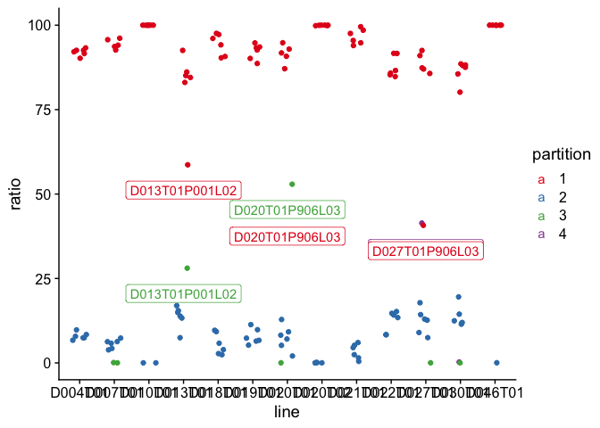
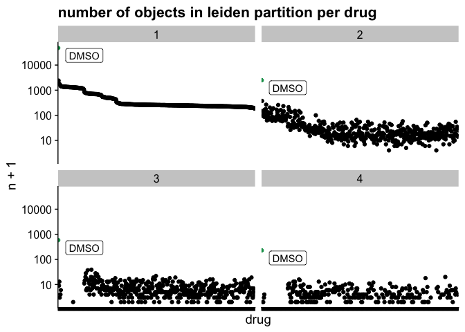
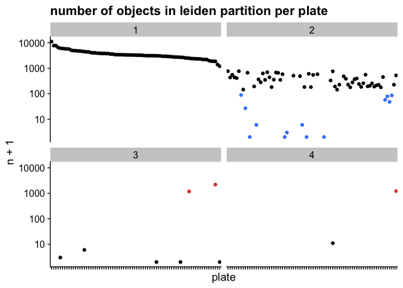
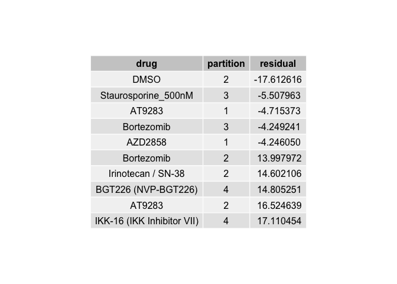
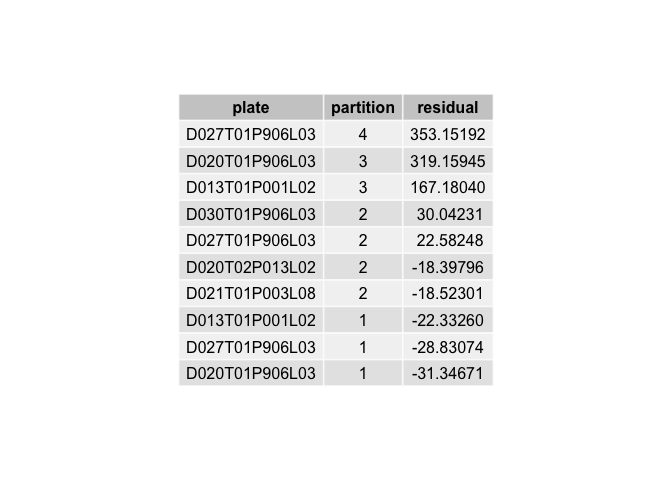
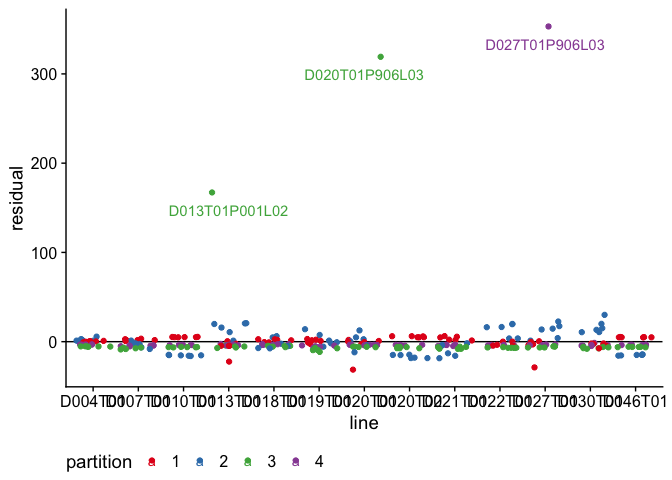
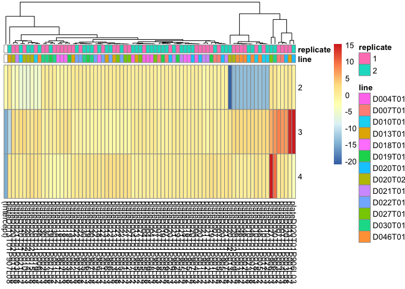
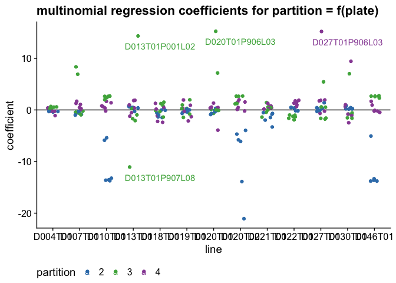

Loading packages


```r
library(tidyverse)
library(tidyr)
library(here)
library(ggrastr)
library(cowplot)
library(princurve)
library(scico)
library(ggridges)
library(gridExtra)

# modeling
library(nnet)
```


```r
print(params$data)
```

```
## [1] "data/processed/PhenotypeSpectrum/umap_absolute_all_drugs_sampled.Rds"
```


loading input data and annotation. Note that on the central cluster, with access to the complete data table, the definition of the input can easily be changed. For remote work, the subsampled dataset "umap_drugs_sampled.Rds" is the default choice.


```r
# I wish I could solve my path problems with the here() package, but experienced unreliable behavior 
# PATH = "/dkfz/groups/shared/OE0049/B110-Isilon2/promise/"
PATH = paste0(here::here(), "/")

#umap_df <- read_rds(paste0(PATH, "data/processed/PhenotypeSpectrum/umap_absolute_all_drugs_tidy.Rds"))
#umap_df <- read_rds(paste0(PATH, "data/processed/PhenotypeSpectrum/umap_absolute_all_drugs_sampled.Rds"))
umap_df <- read_rds(here::here(params$data))

organoid_morphology <- read_delim(here::here("references/imaging/visual_classification_organoids.csv"), ";", escape_double = FALSE, trim_ws = TRUE) %>% 
  dplyr::select(line = organoid, morphology = visual_inspection_v2)
```

# Partition inspection

We are able to observe 4 partitions in our data. 
After manual inspection, it becomes cleat that the two smallest partitions are mostly consisting of 


```r
umap_partition <- umap_df %>% 
  ggplot(aes(v1, v2, color = factor(partition))) + 
  geom_point_rast(alpha = 0.5, size = 0.35) + 
  scale_color_brewer(type = "qual", palette = "Set2") +
  theme_cowplot() +
  labs(x = "UMAP 1",
       y = "UMAP 2",
       color = "partition") + 
  theme(legend.position = "bottom") + 
    coord_fixed()
```


```r
partition_table <- umap_df %>% 
  dplyr::count(partition) %>% 
  mutate(ratio = n/sum(n)*100) %>% 
  arrange(desc(ratio)) %>% 
  left_join(
    # adding the max and min proportion
    umap_df %>% 
  dplyr::count(partition, plate) %>% 
    group_by(plate) %>%
  mutate(ratio = (n/sum(n))*100) %>% 
  arrange(desc(ratio)) %>%
  group_by(partition) %>% 
  summarise(min_ratio = min(ratio) %>% round(3),
            max_ratio = max(ratio) %>% round(3))
  ) %>%
  mutate(ratio = ratio %>% round(3)) %>%
  tableGrob(., theme = ttheme_default(), rows = NULL)

grid.arrange(partition_table)
```

<!-- -->

## drug overrepresentation


```r
df <- umap_df %>% 
  dplyr::select(drug, line, partition) %>% 
  count(drug, partition) %>% 
  arrange(n) 

levels_df <- df %>% filter(partition == 1) %>% arrange(desc(n)) %>% .$drug

df <- df %>% mutate(drug = factor(drug, levels = levels_df)) %>% 
  mutate(group = case_when(drug == "DMSO" ~ "control",
                           TRUE ~ "other"))

partition_count_drug = df %>% 
  ggplot(aes(drug, n+1, color = group)) + 
  geom_point() + 
  facet_wrap(~ partition) + 
  scale_y_log10() + 
  theme_cowplot() + 
  theme(axis.text.x = element_blank()) + 
  labs(title = "number of objects in leiden partition per drug") + 
  geom_label(data = df %>% filter(drug == "DMSO"), aes(label = drug), nudge_x = 70, nudge_y = -.3, color = "black") + 
  scale_color_manual(values = c("#0F9D58", "black")) + 
  theme(legend.position = "nothing")

partition_count_drug
```

<!-- -->


```r
df <- umap_df %>% 
  dplyr::select(plate, drug, line, partition) %>% 
  count(plate, partition) %>% 
  arrange(n) 

levels_df <- df %>% filter(partition == 1) %>% arrange(desc(n)) %>% .$plate

df <- df %>% mutate(plate = factor(plate, levels = levels_df))

## conditional formatting
df <- df %>%
  mutate(group = case_when(partition == 2 & n < 100 ~ "underrepresented in partition 2",
                           partition == 3 & n > 100 ~ "overrepresented in partition 4",
                           partition == 4 & n > 10 ~ "overrepresented in partition 4",
                           TRUE ~ "other"))

partition_count_plate = df %>% 
  ggplot(aes(plate, n+1, color = group)) + 
  geom_point() + 
  facet_wrap(~ partition) + 
  scale_y_log10() + 
  theme_cowplot() + 
  theme(axis.text.x = element_blank()) + 
  labs(title = "number of objects in leiden partition per plate") + 
  scale_color_manual(values = c("black", "#DB4437", "#4285F4")) + 
  theme(legend.position = "nothing")

partition_count_plate
```

<!-- -->

## chi-square


I wonder wether certain batches or organoid lines are overrepresented in each section. 


```r
chi_drug <- umap_df %>% 
  dplyr::select(drug, line, partition) %>% 
  count(drug, partition) %>%
  spread(key = partition, value = n, fill = 0) %>%
  as.data.frame() %>% 
  column_to_rownames("drug") %>% 
  as.matrix() %>% 
  chisq.test()
  
chi_drug <- chi_drug$residuals %>% as.data.frame() %>% 
  rownames_to_column("drug") %>%
  gather("partition", "residual", -drug) %>% 
  arrange(residual)

gg_chi_drug <- chi_drug %>% 
  ggplot(aes(residual)) + 
  geom_histogram() + 
  cowplot::theme_cowplot() + 
  labs(title = "chi square (partition x drug)",
        x = "chi square pearson residual")
```


```r
chi_drug_table <- rbind(chi_drug %>% head(5), chi_drug %>% tail(5)) %>% tableGrob(., theme = ttheme_default(), rows = NULL)

chi_drug_table %>% grid.arrange()
```

<!-- -->

## line overrepresentation


```r
partition_count = umap_df %>% 
  dplyr::select(drug, plate, partition) %>% 
  count(plate, partition) %>%
  #mutate(n = n +5) %>% # adding fudge factor # no difference to result
  #spread(key = partition, value = n, fill = 5) %>% # adding fudge factor # no difference to result
  spread(key = partition, value = n, fill = 0)

chi_line <- partition_count %>%
  as.data.frame() %>% 
  column_to_rownames("plate") %>% 
  as.matrix() %>% 
  chisq.test()
  
chi_line <- chi_line$residuals %>% as.data.frame() %>% 
  rownames_to_column("plate") %>%
  gather("partition", "residual", -plate) %>% 
  arrange(desc(residual))

gg_chi_line <- chi_line %>% 
  ggplot(aes(residual)) + 
  geom_histogram() + 
    cowplot::theme_cowplot() + 
  labs(title = "chi square (partition x plate)",
        x = "chi square pearson residual")
```


```r
chi_line_table <- rbind(chi_line %>% head(5), chi_line %>% tail(5)) %>% tableGrob(., theme = ttheme_default(), rows = NULL)

chi_line_table %>% grid.arrange()
```

<!-- -->


I plot chisq residuals for each plate

I recognize no difference between reimaged plates (leading digit is "9", plates were reimaged due to errors during the first pass) and plates that were not reimaged.


```r
df <- chi_line %>% left_join(umap_df %>% distinct(plate, line) ) %>%
  mutate(leading_9 = substr(plate, 9,9))


gg_chi_plate_line <- df %>% 
  ggplot(aes(line, residual, color = partition)) + 
  geom_hline(yintercept = 0) +
  geom_jitter() + 
  geom_text(data = df %>% filter(residual > 100), aes(label = plate), nudge_y = -20) + 
  scale_color_brewer(type = "qual", palette = "Set1") + 
  
  cowplot::theme_cowplot() + 
  theme(legend.position = "bottom")

gg_chi_plate_line
```

<!-- -->


## multinomial regression

We run a multinomial regression using the *nnet* package.


```r
# preparing data matrix and using partition 1 as reference level
df <- umap_df %>% 
  dplyr::select(drug, line, partition, plate, screen_id) %>% 
  mutate(drug = factor(drug),
         line = factor(line),
         plate = factor(plate),
         screen_id = factor(screen_id))

df$partition %>% table()
```

```
## .
##      1      2      3      4 
## 283583  21320   3385   1228
```

```r
model_intercept = multinom(partition ~ 1, data = df, model = TRUE)
```

```
## # weights:  8 (3 variable)
## initial  value 429080.285479 
## iter  10 value 103934.587764
## final  value 103929.549407 
## converged
```

```r
model_line = multinom(partition ~ line, data = df, model = TRUE)
```

```
## # weights:  56 (39 variable)
## initial  value 429080.285479 
## iter  10 value 93273.146824
## iter  20 value 89261.723946
## iter  30 value 87909.198169
## iter  40 value 87104.566970
## iter  50 value 86086.654631
## iter  60 value 86028.760916
## iter  70 value 86010.747848
## iter  80 value 86003.923852
## iter  90 value 86002.864912
## iter 100 value 85998.378411
## final  value 85998.378411 
## stopped after 100 iterations
```

```r
model_plate = multinom(partition ~ plate, data = df, model = TRUE)
```

```
## # weights:  316 (234 variable)
## initial  value 429080.285479 
## iter  10 value 82518.666121
## iter  20 value 80085.517701
## iter  30 value 79545.739683
## iter  40 value 79080.968936
## iter  50 value 78664.558187
## iter  60 value 78273.598036
## iter  70 value 77701.258495
## iter  80 value 76890.920329
## iter  90 value 76383.229317
## iter 100 value 76309.712980
## final  value 76309.712980 
## stopped after 100 iterations
```

```r
model_screenid = multinom(partition ~ screen_id, data = df, model = TRUE)
```

```
## # weights:  36 (24 variable)
## initial  value 429080.285479 
## iter  10 value 96298.512754
## iter  20 value 92401.865374
## iter  30 value 91225.990894
## iter  40 value 90530.988437
## iter  50 value 90490.948091
## iter  60 value 90480.224419
## iter  70 value 90470.557343
## final  value 90470.537303 
## converged
```

```r
#model_drug = multinom(partition ~ drug, data = df, model = TRUE)

aic_multinomial <- AIC(model_intercept, model_line, model_plate, model_screenid) %>% rownames_to_column("model") %>% arrange(AIC) %>% 
  tableGrob(., theme = ttheme_default(), rows = NULL)
```


```r
anno_col = umap_df %>% 
  distinct(plate, line, replicate) %>%
  mutate(plate = paste0("plate", plate)) %>% 
  as.data.frame() %>% 
  column_to_rownames("plate")
  
coef(model_plate) %>% as.matrix() %>% pheatmap::pheatmap(annotation_col = anno_col, cluster_cols = TRUE, cluster_rows = FALSE)
```

<!-- -->


```r
df <- coef(model_plate) %>% as.data.frame() %>% rownames_to_column("partition") %>% 
  gather("plate", "coefficient", -partition) %>% 
  filter(plate != "(Intercept)") %>% 
  mutate(plate = substr(plate, 6, nchar(.))) %>% 
  left_join(umap_df %>% 
  distinct(plate, line, replicate))

gg_multinomial_line <- df %>% ggplot(aes(line, coefficient, color = partition)) + 
  geom_hline(yintercept = 0) +
  geom_jitter(width = 0.2) + 
  geom_text(data = df %>% filter(abs(coefficient) > 10 & partition %in% c(3, 4)), aes(label = plate), nudge_y = -2, nudge_x = 1) + 
  cowplot::theme_cowplot() + 
  theme(legend.position = "bottom") + 
  labs(title = "multinomial regression coefficients for partition = f(plate)") + 
  scale_color_manual(values = RColorBrewer::brewer.pal(4, "Set1")[2:4])
  
gg_multinomial_line
```

<!-- -->

# conclusion
1. after processing, organoids organize in 4 distinct phenotype partitions
2. the distribution of organoids across these partitions is non-random
2.1 drug treatment influences the distribution of organoids across the partitions
2.1.1 DMSO control treatment are enriched in the 

# figure


```r
plot_grid(umap_partition, grid.arrange(partition_table),
          partition_count_drug, partition_count_plate,
          gg_chi_drug, chi_drug_table %>% grid.arrange(),
          gg_chi_plate_line, chi_line_table %>% grid.arrange(),
          aic_multinomial %>% grid.arrange(), gg_multinomial_line, 
          label_size = 12, 
          align = "hv",
          # scale = c(1.5, .5,
          #           1.5, 1.5, 
          #           1, .5,
          #           1, .5, 
          #           .5, 1),
          labels = "AUTO",
          ncol = 2) + 
  ggsave(here::here("reports/panels/morphology_partition.pdf"),
         width = 210, 
         height = 297, 
          units = "mm")
```


```r
sessionInfo()
```

```
## R version 3.6.1 (2019-07-05)
## Platform: x86_64-apple-darwin13.4.0 (64-bit)
## Running under: macOS  10.16
## 
## Matrix products: default
## BLAS/LAPACK: /Users/rindtorf/github/promise/env/lib/R/lib/libRblas.dylib
## 
## locale:
## [1] C
## 
## attached base packages:
## [1] stats     graphics  grDevices utils     datasets  methods   base     
## 
## other attached packages:
##  [1] nnet_7.3-12     gridExtra_2.3   ggridges_0.5.3  scico_1.2.0    
##  [5] princurve_2.1.4 cowplot_1.1.1   ggrastr_0.2.3   here_0.1       
##  [9] forcats_0.4.0   stringr_1.4.0   dplyr_0.8.0.1   purrr_0.3.2    
## [13] readr_1.3.1     tidyr_0.8.3     tibble_2.1.1    ggplot2_3.1.1  
## [17] tidyverse_1.2.1
## 
## loaded via a namespace (and not attached):
##  [1] beeswarm_0.3.1     tidyselect_0.2.5   xfun_0.6          
##  [4] haven_2.1.0        lattice_0.20-38    colorspace_1.4-1  
##  [7] generics_0.0.2     htmltools_0.3.6    yaml_2.2.0        
## [10] rlang_0.3.4        pillar_1.3.1       glue_1.3.1        
## [13] withr_2.1.2        RColorBrewer_1.1-2 modelr_0.1.4      
## [16] readxl_1.3.1       plyr_1.8.4         munsell_0.5.0     
## [19] gtable_0.3.0       cellranger_1.1.0   rvest_0.3.3       
## [22] codetools_0.2-16   evaluate_0.13      labeling_0.3      
## [25] knitr_1.22         vipor_0.4.5        broom_0.5.2       
## [28] Rcpp_1.0.1         scales_1.0.0       backports_1.1.4   
## [31] jsonlite_1.6       hms_0.4.2          digest_0.6.18     
## [34] stringi_1.4.3      grid_3.6.1         rprojroot_1.3-2   
## [37] cli_1.1.0          tools_3.6.1        magrittr_1.5      
## [40] lazyeval_0.2.2     crayon_1.3.4       pkgconfig_2.0.2   
## [43] pheatmap_1.0.12    xml2_1.2.0         ggbeeswarm_0.6.0  
## [46] lubridate_1.7.4    assertthat_0.2.1   rmarkdown_1.12    
## [49] httr_1.4.0         rstudioapi_0.10    R6_2.4.0          
## [52] nlme_3.1-139       compiler_3.6.1
```


